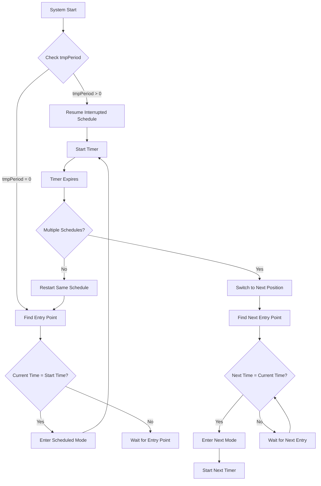

# Aura Firmware Documentation v1.19

## Table of Contents
1. [System Overview](#system-overview)
2. [Component Architecture](#component-architecture)
3. [Communication Protocols](#communication-protocols)
4. [System Events](#system-events)
5. [AQI Calculation Formulas](#aqi-calculation-formulas)
6. [EEPROM Structure](#eeprom-structure)
7. [Sensor Specifications](#sensor-specifications)
8. [System Modes](#system-modes)
9. [Cloud Functions](#cloud-functions)
10. [Hardware Configuration](#hardware-configuration)

## System Overview

The Aura firmware is an air quality monitoring and purification system built on the Particle platform. It integrates multiple sensors to measure air quality parameters and controls various components like fans, UV-C lights, and sterilizers based on the measured data.

### Key Features
- Real-time air quality monitoring (CO2, TVOC, PM2.5, PM10, CO)
- Multiple operating modes (Auto, High, Low, Silent, Night, Scheduled, Off)
- Cloud connectivity with Particle platform
- EEPROM-based configuration storage
- Component chain of responsibility pattern
- PID-controlled fan speed regulation

## Component Architecture

### Core Components

#### 1. AqiAnalyzer
**Purpose**: Central air quality analysis and sensor coordination
**Key Features**:
- Manages 5 different sensors (HDC1080, SGP30, ZPH02, ME2_CO)
- Implements moving average calculation for AQI (50-sample window)
- Publishes sensor data every 3 minutes (180,000ms)
- Determines dominant pollutant and triggers system events

**Data Published**:
```json
{
  "v1": 25.5,     // Temperature (°C)
  "v2": 45.2,     // Humidity (%)
  "v3": 450,      // CO2 (ppm)
  "v4": 120,      // TVOC (ppb)
  "v5": 15,       // PM2.5 (μg/m³)
  "v6": 25,       // PM10 (μg/m³)
  "v7": "v3",     // Dominant pollutant code
  "v8": 8.5,      // AQI value
  "v9": 2.1,      // CO (ppm)
  "v10": 1200     // Current fan speed (RPM)
}
```

#### 2. Fan Control
**Purpose**: Intelligent fan speed control with PID regulation
**Key Features**:
- PID controller for precise RPM control
- Multiple speed levels for different system modes
- Tachometer feedback for closed-loop control
- PWM-based speed control (4-50 PWM range)

**Speed Levels**:
- **Auto Mode Levels**:
  - Level 0: 1200 RPM (AQI < 50)
  - Level 1: 1400 RPM (AQI < 100)
  - Level 2: 1800 RPM (AQI < 200)
  - Level 3: 2000 RPM (AQI < 500)
- **Auto-Silent Mode Levels**:
  - Level 0: 500 RPM (AQI < 50)
  - Level 1: 900 RPM (AQI < 100)
  - Level 2: 1200 RPM (AQI < 200)
  - Level 3: 1400 RPM (AQI < 500)
- **Manual Mode Levels**:
  - Manual 1: 900 RPM
  - Manual 2: 1500 RPM
  - Manual 3: 2500 RPM
- **Fixed Mode Levels**:
  - Silent: 500 RPM
  - Night: 900 RPM  
  - Low: 1200 RPM
  - High: 2000 RPM
  - Off: 0 RPM

#### 3. System Modes Manager
**Purpose**: Orchestrates different operating modes and scheduling
**Modes**:
- **Auto Mode**: AQI-based automatic control with 4 speed levels
- **Auto-Silent Mode**: AQI-based control with reduced noise levels
- **High Mode**: Maximum purification (2000 RPM)
- **Low Mode**: Energy-efficient operation (1200 RPM)
- **Silent Mode**: Quiet operation (500 RPM)
- **Night Mode**: Reduced noise for sleep (900 RPM)
- **Manual 1 Mode**: Custom speed level 1 (900 RPM)
- **Manual 2 Mode**: Custom speed level 2 (1500 RPM)
- **Manual 3 Mode**: Custom speed level 3 (2500 RPM)
- **Scheduled Mode**: Time-based operation
- **Off Mode**: System shutdown

#### 4. EEPROM Manager
**Purpose**: Persistent configuration storage using JSON format
**Features**:
- 2KB EEPROM storage with JSON serialization
- Automatic data migration on firmware updates
- Backup and restore functionality
- Memory usage monitoring

## Communication Protocols

### 1. Particle Cloud Communication
**Event Types**:
- **Normal Events** (`'N'`): Sensor data and system status
- **Support Events** (`'S'`): System diagnostics and error reporting

**Event Structure**:
```json
{
  "code": "1.1.0",
  "name": "support.modes", 
  "type": "info",
  "message": "Enter auto mode"
}
```

### 2. I2C Communication
**Sensors using I2C**:
- **SGP30**: Air quality sensor (Address: 0x58)
- **HDC1080**: Temperature/Humidity sensor (Address: 0x40)

### 3. Serial Communication
**ZPH02 PM Sensor**: UART communication at 9600 baud
- Protocol: Custom with start byte (0xFF) and name code (0x18)
- Data validation using checksum

### 4. Analog Communication
**ME2_CO Sensor**: Analog voltage reading on pin A0
- Voltage range: 0-3.3V
- Conversion: (3300/4096) * ADC_reading (millivolts)

## System Events

### Event Categories

#### 1. Cover Events
- `COVER_OPEN`: Cover opened
- `COVER_CLOSE`: Cover closed

#### 2. Mode Events
- `ENTER_AUTO_M`: Enter auto mode
- `ENTER_HIGH_M`: Enter high mode
- `ENTER_LOW_M`: Enter low mode
- `ENTER_QUICK_M`: Enter quick mode
- `ENTER_SILENT_M`: Enter silent mode
- `EXIT_SILENT_M`: Exit silent mode
- `ENTER_NIGHT_M`: Enter night mode
- `EXIT_NIGHT_M`: Exit night mode
- `ENTER_OFF_M`: Enter off mode
- `ENTER_MANUAL_1_M`: Enter manual 1 mode
- `ENTER_MANUAL_2_M`: Enter manual 2 mode
- `ENTER_MANUAL_3_M`: Enter manual 3 mode
- `AUTO_SILENT_ON`: Enable auto-silent mode
- `AUTO_SILENT_OFF`: Disable auto-silent mode

#### 3. AQI Events
- `AQI_LESS_50`: AQI < 5.0
- `AQI_LESS_100`: AQI < 10.0
- `AQI_LESS_200`: AQI < 20.0
- `AQI_LESS_500`: AQI < 50.0

#### 4. Component Events
- `LED_ON/OFF`: LED control
- `STERIO_AUTO/CONST_ON/CONST_OFF`: Sterilizer control
- `UVC_AUTO/CONST_ON/CONST_OFF`: UV-C control
- `FAN_AUTO/MANU_BY_PID/MANU_BY_PWM`: Fan control modes
- `SERVO_ON/OFF`: Servo control

## AQI Calculation Formulas

### Moving Average Calculation
```cpp
// 50-sample moving average with exponential smoothing
aqiMovingAvg[currentIndex] = (currentAQI + aqiMovingAvg[previousIndex]) / 2
if (aqiMovingAvg[currentIndex] < 1.0) aqiMovingAvg[currentIndex] = 1.0
```

### Individual Pollutant AQI Classes

#### CO2 AQI Classification
```cpp
if (Eco2 < 465) return 1;
else if (Eco2 < 570) return 2;
else if (Eco2 < 676) return 3;
else if (Eco2 < 884) return 4;
else if (Eco2 < 974) return 5;
else if (Eco2 < 1064) return 6;
else if (Eco2 < 1154) return 7;
else if (Eco2 < 1244) return 8;
else if (Eco2 < 1333) return 9;
else if (Eco2 < 1765) return 10;
else if (Eco2 < 2551) return 15;
else if (Eco2 < 3205) return 20;
else if (Eco2 < 3851) return 25;
else if (Eco2 < 4140) return 30;
else if (Eco2 < 4428) return 35;
else if (Eco2 < 4717) return 40;
else if (Eco2 <= 5000) return 45;
```

#### TVOC AQI Classification
```cpp
if (tvoc < 15) return 1;
else if (tvoc < 30) return 2;
else if (tvoc < 44) return 3;
else if (tvoc < 74) return 4;
else if (tvoc < 108) return 5;
else if (tvoc < 142) return 6;
else if (tvoc < 177) return 7;
else if (tvoc < 211) return 8;
else if (tvoc < 247) return 9;
else if (tvoc < 740) return 10;
else if (tvoc < 1230) return 15;
else if (tvoc < 1845) return 20;
else if (tvoc < 2460) return 25;
else if (tvoc < 3095) return 30;
else if (tvoc < 3730) return 35;
else if (tvoc < 4365) return 40;
else if (tvoc <= 5000) return 45;
```

#### PM2.5 AQI Classification
```cpp
if (pm2 < 2) return 1;
else if (pm2 < 5) return 2;
else if (pm2 < 7) return 3;
else if (pm2 < 12) return 4;
else if (pm2 < 16) return 5;
else if (pm2 < 21) return 6;
else if (pm2 < 25) return 7;
else if (pm2 < 30) return 8;
else if (pm2 < 35) return 9;
else if (pm2 < 55) return 10;
else if (pm2 < 150) return 15;
else if (pm2 < 200) return 20;
else if (pm2 < 250) return 25;
else if (pm2 < 313) return 30;
else if (pm2 < 375) return 35;
else if (pm2 < 438) return 40;
else if (pm2 >= 438) return 45;
```

#### PM10 AQI Classification
```cpp
if (pm10 < 11) return 1;
else if (pm10 < 22) return 2;
else if (pm10 < 33) return 3;
else if (pm10 < 55) return 4;
else if (pm10 < 75) return 5;
else if (pm10 < 95) return 6;
else if (pm10 < 115) return 7;
else if (pm10 < 135) return 8;
else if (pm10 < 155) return 9;
else if (pm10 < 255) return 10;
else if (pm10 < 355) return 15;
else if (pm10 < 390) return 20;
else if (pm10 < 425) return 25;
else if (pm10 < 470) return 30;
else if (pm10 < 515) return 35;
else if (pm10 < 560) return 40;
else if (pm10 >= 560) return 45;
```

#### CO AQI Classification
```cpp
if (co < 4.5) return 1;
else if (co < 9.5) return 5;
else if (co < 12.5) return 10;
else if (co < 15.5) return 15;
else if (co < 23.0) return 20;
else if (co < 30.5) return 25;
else if (co < 35.5) return 30;
else if (co < 40.5) return 35;
else if (co < 45.5) return 40;
else if (co >= 45.5) return 45;
```

### Final AQI Calculation
The system takes the maximum AQI class from all pollutants as the final AQI value.

## EEPROM Structure

### JSON Schema
```json
{
  "scheduler": {
    "size": 3,
    "position": 1,
    "sched1": {
      "whoami": 1,
      "start-time": "08:00",
      "period": 8.0,
      "tmp-period": 2.5
    },
    "sched2": {
      "whoami": 2,
      "start-time": "16:00", 
      "period": 6.0
    },
    "sched3": {
      "whoami": 3,
      "start-time": "22:00",
      "period": 10.0
    },
    "sched4": {
      "whoami": -1,
      "start-time": null,
      "period": 0.0
    },
    "sched5": {
      "whoami": -1,
      "start-time": null,
      "period": 0.0
    },
    "sched6": {
      "whoami": -1,
      "start-time": null,
      "period": 0.0
    }
  },
  "active-mode": {
    "current": 1,
    "default": 2
  },
  "panic-reset": {
    "panic-counter": 0,
    "last-panic-event": 0
  },
  "user-reset": {
    "reset-counter": 0,
    "last-reset-event": 0
  },
  "uvc-switch": 21,
  "sterio-switch": 18,
  "led-switch": {
    "state": true
  },
  "led_scheduler": {
    "enabled": false,
    "start": null,
    "end": null,
    "state": true
  },
  "timezone": 0
}
```

### Scheduler EEPROM Structure Details

The scheduler data is stored in a hierarchical JSON structure within the EEPROM:

#### Top-Level Scheduler Object
- **size**: Number of active schedules (0-6)
- **position**: Current active schedule index (0-5)
- **sched1-sched6**: Individual schedule objects

#### Individual Schedule Objects
Each schedule (sched1 through sched6) contains:
- **whoami**: System mode enum value
  - `0` = Auto Mode
  - `1` = High Mode
  - `2` = Low Mode  
  - `3` = Night Mode
  - `4` = Scheduler Mode
  - `5` = Silent Mode
  - `6` = Manual 1 Mode
  - `7` = Off Mode
  - `8` = Manual 2 Mode
  - `9` = Manual 3 Mode
  - `10` = Auto-Silent Mode
  - `11` = Quick Mode
  - `-1` = Not Initialized (empty slot)
- **start-time**: Time string in HH:MM format (24-hour)
- **period**: Duration in hours (0.1-24.0)
- **tmp-period**: Temporary period for recovery (only used in sched1)

#### Scheduler Initialization
When the EEPROM is first initialized, all 6 schedule slots are created with default values:
```json
"sched1": {
  "whoami": -1,
  "start-time": null,
  "period": 0.0,
  "tmp-period": 0.0
}
```

#### Scheduler Persistence Behavior
- **Real-time Updates**: Position changes are saved immediately to EEPROM
- **Schedule Creation**: New schedules overwrite existing slots sequentially
- **Schedule Deletion**: Removed schedules are reset to default values
- **Recovery Data**: The `tmp-period` field in sched1 stores recovery information
- **Cross-Session Persistence**: All schedule data survives power cycles and reboots

### Memory Layout
- **Address 1**: EEPROM initialization flag
- **Address 2**: JSON data start (900 bytes)
- **Address 2043**: Re-initialization flag
- **Total Size**: 2048 bytes

### Data Types
- **whoami**: System mode enum (int8_t)
- **start-time**: Time string (char[6])
- **period**: Duration in hours (float)
- **state**: Boolean flags (bool)
- **timezone**: Timezone offset (int8_t)

## Sensor Specifications

### 1. HDC1080 (Temperature & Humidity)
- **Interface**: I2C (Address: 0x40)
- **Temperature Range**: -40°C to +125°C
- **Humidity Range**: 0-100% RH
- **Resolution**: 16-bit
- **Update Rate**: Continuous
- **Formula**: 
  - Temperature: `(raw_value / 65536) * 165 - 40`
  - Humidity: `(raw_value / 65536) * 100`

### 2. SGP30 (CO2 & TVOC)
- **Interface**: I2C (Address: 0x58)
- **CO2 Range**: 400-60000 ppm
- **TVOC Range**: 0-60000 ppb
- **Humidity Compensation**: Yes (absolute humidity)
- **CRC8 Validation**: Yes
- **Update Rate**: 12ms delay between commands

### 3. ZPH02 (PM2.5 & PM10)
- **Interface**: UART (9600 baud)
- **Protocol**: Custom with 0xFF start byte
- **PM2.5 Range**: 0-1000 μg/m³
- **PM10 Range**: 0-1000 μg/m³
- **Data Validation**: Checksum verification
- **Formula**: 
  - PM2.5: `round((data[3] + 0.01 * data[4])/0.1)`
  - PM10: `round((pm2 + 6.0767) / 0.779) + random(0,7)`

### 4. ME2-CO (Carbon Monoxide)
- **Interface**: Analog (Pin A0)
- **Range**: 0-50 ppm
- **Resolution**: 12-bit ADC
- **Formula**: `(3300 / 4096.0) * adc_raw` (millivolts)
- **Update Rate**: 5 seconds

## System Modes

### Mode Definitions
```cpp
enum SysMode {
    NOT_INIT = -1,
    AUTO_M = 0,         // AQI-based automatic control
    HIGH_M = 1,         // Maximum purification (FS-5)
    LOW_M = 2,          // Energy-efficient operation (FS-3)
    NIGHT_M = 3,        // Sleep mode (SCHEDULER ONLY)
    SCHEDULER_M = 4,    // Time-based scheduling
    SILENT_M = 5,       // Quiet operation (FS-1)
    MANUAL_1_M = 6,     // Manual speed level 1 (FS-2)
    OFF_M = 7,          // Standby mode
    MANUAL_2_M = 8,     // Manual speed level 2 (FS-4)
    MANUAL_3_M = 9,     // Manual speed level 3 (FS-6)
    AUTO_SILENT = 10,   // AQI-based with reduced noise
    QUICK_M = 11        // Quick purification
}
```

### Auto-Silent Mode

The Auto-Silent mode is a special variant of the Auto mode that provides AQI-based automatic control with reduced noise levels. This mode is particularly useful in environments where noise sensitivity is important while still maintaining intelligent air quality management.

#### Auto-Silent Mode Behavior
- **Activation**: Triggered by `AUTO_SILENT_ON` event
- **Deactivation**: Triggered by `AUTO_SILENT_OFF` event
- **Fan Speed Levels**: Reduced compared to standard Auto mode
- **AQI Response**: Same AQI thresholds as Auto mode but with quieter fan speeds

#### Auto-Silent vs Auto Mode Comparison

| AQI Level | Auto Mode RPM | Auto-Silent RPM | Noise Reduction |
|-----------|---------------|-----------------|-----------------|
| < 50      | 1200          | 500             | ~58% quieter    |
| < 100     | 1400          | 900             | ~36% quieter    |
| < 200     | 1800          | 1200            | ~33% quieter    |
| < 500     | 2000          | 1400            | ~30% quieter    |

#### Auto-Silent Implementation
The system uses a boolean flag `isAutoSilent` in the Fan component to determine which speed levels to use:

```cpp
case SysEvent::AQI_LESS_50:
{
    if(this->isAutoSilent) {
        if (this->fanSpeed != (double)FAN_AS_LVL_0)
            this->setFanSpeed((double)FAN_AS_LVL_0);  // 500 RPM
    } else {
        if (this->fanSpeed != (double)FAN_LVL_0)
            this->setFanSpeed((double)FAN_LVL_0);     // 1200 RPM
    }
    break;
}
```

#### Use Cases for Auto-Silent Mode
- **Office Environments**: During meetings or quiet work periods
- **Residential**: Nighttime operation with reduced noise
- **Healthcare Facilities**: Patient areas requiring minimal noise
- **Libraries/Study Areas**: Quiet environments with air quality needs
- **Conference Rooms**: Professional settings with noise sensitivity

### Scheduler System

The scheduler system allows users to create complex time-based automation with multiple scheduled modes that can run at different times throughout the day. The system supports up to 6 concurrent schedules that can be configured with different modes, start times, and durations.

#### Scheduler Architecture

**Core Components**:
- **Scheduler**: Main coordinator managing the schedule pool
- **ScheduledMode**: Base class for all scheduled modes
- **Position Tracking**: Current active schedule index (0-5)
- **Timer Management**: Individual timers for each scheduled mode

#### Schedule Configuration

**Maximum Schedules**: 6 concurrent schedules
**Time Format**: HH:MM (24-hour format)
**Period Range**: 0.1-24.0 hours
**Supported Modes**: High, Low, Silent, Night, Off, Manual 1, Manual 2, Manual 3

#### Schedule Data Structure

Each schedule contains:
```cpp
struct ScheduleData {
    SysMode whoami;        // Mode type (High, Low, Silent, Night, Off, Manual 1-3)
    char sTime[6];         // Start time (HH:MM format)
    float period;          // Duration in hours
    float tmpPeriod;       // Temporary period for recovery
    bool activeNow;        // Current active status
    Timer* timer;          // Individual timer instance
}
```

#### Scheduler Operation Modes

##### 1. Single Schedule Mode
- Only one schedule configured
- Runs continuously until manually stopped
- No position switching required

##### 2. Multiple Schedule Mode
- 2-6 schedules configured
- Automatic position switching when timers expire
- Circular scheduling (returns to first after last)

#### Schedule Execution Flow



#### Schedule Recovery System

The scheduler includes sophisticated recovery mechanisms for power interruptions:

##### Power Loss Recovery
When the system restarts after a power loss, it calculates the remaining time for the interrupted schedule:

```cpp
// Calculate time difference between current time and scheduled start time
double diff = (difftime(currentTime, scheduledStartTime) / 3600);

if (diff < 0 && diff < period/2) {
    // Schedule hasn't started yet, use full period
    tmpPeriod = (period/2) + diff;
} else if (diff > 0 && diff < period/2) {
    // Schedule is in progress, calculate remaining time
    tmpPeriod = (period/2) - diff;
}
```

##### Recovery Scenarios
1. **Schedule Not Started**: Full period duration
2. **Schedule In Progress**: Remaining time calculation
3. **Schedule Completed**: Move to next position
4. **Cross-Day Recovery**: Handle day transitions

#### Schedule Position Management

**Position Enumeration**:
```cpp
enum SchedPosition {
    FIRST = 0,    // Schedule 1
    SECOND = 1,   // Schedule 2
    THIRD = 2,    // Schedule 3
    FOURTH = 3,   // Schedule 4
    FIFTH = 4,    // Schedule 5
    SIXTH = 5     // Schedule 6
}
```

**Position Switching Logic**:
```cpp
// Circular position switching
this->pos = (SchedPosition)(((uint8_t)this->pos + 1) % (uint8_t)this->size);
```

#### Timer Management

Each scheduled mode has its own timer with specific behaviors:

##### Timer Calculation
```cpp
// For temporary periods (recovery)
unsigned int tmpP = int(tmpPeriod * 60 * 60 * 1000);

// For normal periods (half-period for mode switching)
unsigned int p = int(period * 0.5 * 60 * 60 * 1000);
```

##### Timer States
- **Active**: Currently running
- **Expired**: Ready to switch positions
- **Disposed**: Cleaned up when schedule removed

#### Schedule Examples

##### Example 1: Daily Work Schedule
```json
{
  "scheduler": {
    "size": 3,
    "position": 0,
    "sched1": {
      "whoami": 1,        // High Mode
      "start-time": "08:00",
      "period": 8.0       // 8 hours
    },
    "sched2": {
      "whoami": 2,        // Low Mode  
      "start-time": "16:00",
      "period": 6.0       // 6 hours
    },
    "sched3": {
      "whoami": 3,        // Night Mode
      "start-time": "22:00", 
      "period": 10.0      // 10 hours
    }
  }
}
```

**Timeline**:
- 08:00-16:00: High Mode (8 hours)
- 16:00-22:00: Low Mode (6 hours)  
- 22:00-08:00: Night Mode (10 hours)

##### Example 2: Office Hours Schedule with Manual Modes
```json
{
  "scheduler": {
    "size": 5,
    "position": 0,
    "sched1": {
      "whoami": 1,        // High Mode
      "start-time": "09:00",
      "period": 3.0       // 3 hours
    },
    "sched2": {
      "whoami": 6,        // Manual 1 Mode
      "start-time": "12:00", 
      "period": 1.0       // 1 hour (lunch break)
    },
    "sched3": {
      "whoami": 8,        // Manual 2 Mode
      "start-time": "13:00",
      "period": 4.0       // 4 hours
    },
    "sched4": {
      "whoami": 5,        // Silent Mode
      "start-time": "17:00",
      "period": 2.0       // 2 hours
    },
    "sched5": {
      "whoami": 7,        // Off Mode
      "start-time": "19:00",
      "period": 14.0      // 14 hours (overnight)
    }
  }
}
```

**Timeline**:
- 09:00-12:00: High Mode (3 hours)
- 12:00-13:00: Manual 1 Mode (1 hour)
- 13:00-17:00: Manual 2 Mode (4 hours)
- 17:00-19:00: Silent Mode (2 hours)
- 19:00-09:00: Off Mode (14 hours)

#### Schedule Entry Point Detection

The system continuously monitors for schedule entry points:

```cpp
void Scheduler::findSchedEntryPoint() {
    if (String(this->schedPool[this->pos]->sTime) == Time.format("%H:%M")) {
        this->schedModeEnds = false;
        this->schedPool[this->pos]->enterMode();
    }
}
```

#### Schedule Mode Behaviors

##### High Scheduled Mode
- **Fan Speed**: 2000 RPM (maximum)
- **UV-C**: Auto mode
- **Sterilizer**: Auto mode
- **LED**: Normal operation
- **Use Case**: Peak air purification

##### Low Scheduled Mode  
- **Fan Speed**: 1200 RPM (energy efficient)
- **UV-C**: Auto mode
- **Sterilizer**: Auto mode
- **LED**: Normal operation
- **Use Case**: Regular air maintenance

##### Silent Scheduled Mode
- **Fan Speed**: 500 RPM (quiet operation)
- **UV-C**: Auto mode
- **Sterilizer**: Auto mode
- **LED**: Reduced brightness
- **Use Case**: Quiet periods, meetings

##### Night Scheduled Mode
- **Fan Speed**: 900 RPM (sleep-friendly)
- **UV-C**: Auto mode
- **Sterilizer**: Auto mode
- **LED**: Minimal operation
- **Use Case**: Sleep hours

##### Off Scheduled Mode
- **Fan Speed**: 0 RPM (system off)
- **UV-C**: Off
- **Sterilizer**: Off
- **LED**: Off
- **Use Case**: Complete system shutdown periods

##### Manual 1 Scheduled Mode
- **Fan Speed**: 900 RPM (custom level 1)
- **UV-C**: Auto mode
- **Sterilizer**: Auto mode
- **LED**: Normal operation
- **Use Case**: Custom low-speed operation

##### Manual 2 Scheduled Mode
- **Fan Speed**: 1500 RPM (custom level 2)
- **UV-C**: Auto mode
- **Sterilizer**: Auto mode
- **LED**: Normal operation
- **Use Case**: Custom medium-speed operation

##### Manual 3 Scheduled Mode
- **Fan Speed**: 2500 RPM (custom level 3)
- **UV-C**: Auto mode
- **Sterilizer**: Auto mode
- **LED**: Normal operation
- **Use Case**: Custom high-speed operation

#### Schedule Persistence

All schedule data is automatically saved to EEPROM:
- **Real-time Updates**: Position changes saved immediately
- **Power Loss Protection**: Complete schedule state preserved
- **Recovery Data**: Temporary periods stored for resumption
- **Validation**: Data integrity checks on startup

#### Schedule Management Commands

**Cloud Functions**:
- `setSystemMode`: Configure new schedules
- `printEEPROM`: View current schedule configuration
- `clearEEPROM`: Remove all schedules

**Schedule Definition Format**:
```
setSystemMode("scheduler,1,08:00,8.0,2,16:00,6.0,3,22:00,10.0")
setSystemMode("scheduler,6,09:00,4.0,8,13:00,4.0,7,17:00,12.0")
```
Format: `scheduler,mode1,time1,period1,mode2,time2,period2,...`

**Mode Numbers**:
- `0` = Auto Mode
- `1` = High Mode
- `2` = Low Mode
- `3` = Night Mode
- `5` = Silent Mode
- `6` = Manual 1 Mode
- `7` = Off Mode
- `8` = Manual 2 Mode
- `9` = Manual 3 Mode

#### Error Handling

**Schedule Validation**:
- Period range: 0.1-24.0 hours
- Time format: HH:MM (24-hour)
- Mode validation: Must be High, Low, Silent, Night, Off, or Manual 1-3
- Maximum schedules: 6 concurrent

**Recovery Mechanisms**:
- Invalid schedules default to Night mode
- Corrupted EEPROM data triggers re-initialization
- Timer failures result in fallback to default mode
- Position tracking errors reset to first position

### LED Scheduler System

The LED scheduler provides time-based automation for LED control, allowing users to schedule when the LED should be on or off throughout the day. This feature operates independently from the main system scheduler and provides simple time range-based control.

#### LED Scheduler Architecture

**Core Components**:
- **Time Range Checking**: Validates if current time falls within scheduled range
- **State Management**: Tracks enabled/disabled state and scheduled LED state
- **Fallback Behavior**: Returns to default LED switch state when outside scheduled range
- **System Mode Integration**: Automatically disabled during system modes (Night, Silent, etc.)

#### LED Scheduler Configuration

**Time Format**: HH:MM (24-hour format, same as regular scheduler)
**Check Interval**: Every 10 seconds for responsive updates
**Time Range Support**: Supports ranges that cross midnight (e.g., 22:00 to 08:00)
**Scheduled States**: `on` or `off`

#### LED Scheduler Data Structure

The LED scheduler stores its configuration in EEPROM under the `led_scheduler` key:

```json
{
  "led_scheduler": {
    "enabled": true,
    "start": "08:00",
    "end": "22:00",
    "state": true
  }
}
```

**Fields**:
- **enabled**: Boolean flag indicating if scheduler is active
- **start**: Start time in HH:MM format (24-hour)
- **end**: End time in HH:MM format (24-hour)
- **state**: Boolean indicating LED state during scheduled range (`true` = on, `false` = off)

#### LED Scheduler Operation

##### Time Range Logic

The scheduler uses a time range comparison algorithm that handles both same-day and cross-midnight ranges:

```cpp
bool Led::_isTimeInRange(const char *current, const char *start, const char *end) {
    int cur = _parseTimeToMinutes(current);  // Convert HH:MM to minutes
    int s = _parseTimeToMinutes(start);
    int e = _parseTimeToMinutes(end);
    
    if (s <= e) {
        // Same-day range (e.g., 08:00 to 22:00)
        return cur >= s && cur < e;
    } else {
        // Cross-midnight range (e.g., 22:00 to 08:00)
        return cur >= s || cur < e;
    }
}
```

##### Scheduled State Behavior

**When in scheduled range**:
- LED state is set to the scheduled state (`on` or `off`)
- Overrides the default LED switch state

**When outside scheduled range**:
- LED state returns to the default LED switch state
- Respects manual LED switch settings

**When scheduler disabled**:
- LED operates according to default LED switch state only
- No time-based automation applied

##### System Mode Integration

The LED scheduler is automatically disabled when the system enters certain modes:
- **Night Mode**: Scheduler disabled, LED follows Night mode behavior
- **Silent Mode**: Scheduler disabled, LED follows Silent mode behavior
- **Other System Modes**: Scheduler remains active unless explicitly disabled

When exiting these modes, the scheduler resumes normal operation.

#### LED Scheduler Examples

##### Example 1: Daytime LED Schedule
```json
{
  "led_scheduler": {
    "enabled": true,
    "start": "08:00",
    "end": "22:00",
    "state": true
  }
}
```

**Behavior**:
- 08:00-22:00: LED ON
- 22:00-08:00: LED follows default switch state

##### Example 2: Nighttime LED Schedule
```json
{
  "led_scheduler": {
    "enabled": true,
    "start": "22:00",
    "end": "08:00",
    "state": false
  }
}
```

**Behavior**:
- 22:00-08:00: LED OFF (crosses midnight)
- 08:00-22:00: LED follows default switch state

##### Example 3: Office Hours Schedule
```json
{
  "led_scheduler": {
    "enabled": true,
    "start": "09:00",
    "end": "17:00",
    "state": true
  }
}
```

**Behavior**:
- 09:00-17:00: LED ON (office hours)
- 17:00-09:00: LED follows default switch state

#### LED Scheduler Management

**Cloud Function**: `setLedScheduler`

**Command Format**:
```
setLedScheduler("HH:mm,HH:mm,on")   // Enable scheduler with ON state
setLedScheduler("HH:mm,HH:mm,off")  // Enable scheduler with OFF state
setLedScheduler("disable")          // Disable scheduler
```

**Examples**:
```
setLedScheduler("08:00,22:00,on")   // LED ON from 8 AM to 10 PM
setLedScheduler("22:00,08:00,off") // LED OFF from 10 PM to 8 AM (crosses midnight)
setLedScheduler("09:00,17:00,on")   // LED ON during office hours
setLedScheduler("disable")          // Disable LED scheduler
```

**Return Values**:
- `1`: Success (scheduler configured or disabled)
- `0`: Failure (invalid time format or parameters)

#### LED Scheduler Validation

**Time Format Validation**:
- Must be exactly 5 characters: `HH:MM`
- Hours: 00-23 (24-hour format)
- Minutes: 00-59
- Colon separator required at position 2

**Error Handling**:
- Invalid time format: Returns 0, scheduler unchanged
- Invalid time values: Returns 0, scheduler unchanged
- Empty string: Disables scheduler (returns 1)
- "disable" string: Disables scheduler (returns 1)

#### LED Scheduler Persistence

All LED scheduler data is automatically saved to EEPROM:
- **Real-time Updates**: Configuration changes saved immediately
- **Power Loss Protection**: Schedule state preserved across reboots
- **State Recovery**: Scheduler state restored on system startup

#### LED Scheduler vs Regular Scheduler

| Feature | LED Scheduler | Regular Scheduler |
|---------|--------------|-------------------|
| **Purpose** | LED on/off control | System mode scheduling |
| **Time Format** | HH:MM (same) | HH:MM |
| **Check Frequency** | Every 10 seconds | Continuous monitoring |
| **Range Support** | Single time range | Multiple schedules (up to 6) |
| **State Options** | on/off | Multiple system modes |
| **Cross-Midnight** | Supported | Supported |
| **Persistence** | EEPROM | EEPROM |
| **System Mode Override** | Disabled in Night/Silent | Independent operation |

## Cloud Functions

### Available Functions
1. **printEEPROM**: Display EEPROM contents
2. **clearEEPROM**: Clear all EEPROM data
3. **setSystemMode**: Change system mode
4. **setFanSpeed**: Manual fan speed control
5. **getFanRPM**: Get current fan RPM
6. **switchLed**: Toggle LED state
7. **setLedScheduler**: Configure LED time-based scheduler
8. **switchSterio**: Toggle sterilizer
9. **getSterioDiagnos**: Get sterilizer diagnostics
10. **switchUvc**: Toggle UV-C light
11. **setTimeZone**: Set timezone offset
12. **setTime**: Set system time
13. **setCredentials**: Set WiFi credentials
14. **printCreds**: Display WiFi credentials
15. **reset**: Hard system reset
16. **turnServo**: Control servo motor

### Cloud Variables
- **FW_VER**: Firmware version
- **SSID**: Current WiFi network
- **EEPROMContent**: EEPROM data dump

## Hardware Configuration

### Pin Assignments (HW_VER = 1)
- **Fan Control**: P1S0 (PWM output)
- **Fan Tachometer**: P1S3 (Digital input)
- **UV-C Control**: P1S1 (Digital output)
- **Sterilizer Control**: D2 (Digital output)
- **Sterilizer Diagnostic**: A1 (Analog input)
- **CO Sensor**: A0 (Analog input)
- **Servo Control**: TX (PWM output)

### Communication Interfaces
- **I2C**: SDA/SCL for HDC1080 and SGP30
- **UART**: Serial1 for ZPH02 PM sensor
- **WiFi**: Built-in Particle WiFi module
- **Cloud**: Particle Cloud connectivity

### Power Management
- **WiFi Auto-off**: Disconnects when cloud connection lost
- **Reconnection Timer**: 2-minute retry interval
- **Low Power Modes**: Available in silent/night modes

## Error Handling

### Sensor Error Codes
```cpp
enum SensorErr {
    SETUP_ERR,
    I2C_END_TRANSMISSION_ERR,
    I2C_REQUEST_FROM_ERR,
    CRC_ERR,
    HUMIDITY_COMPENSTATION_FAILED,
    DATA_NOT_READY,
    SERIAL_NOT_AVAILABLE_MORE_THEN_5_TIMES,
    NO_ERR
}
```

### System Error Handling
- **Sensor Failures**: Graceful degradation with error reporting
- **Communication Errors**: Automatic retry with exponential backoff
- **EEPROM Corruption**: Automatic re-initialization
- **WiFi Disconnection**: Automatic reconnection attempts

## Performance Characteristics

### Timing Intervals
- **Sensor Data Publishing**: 3 minutes (180,000ms)
- **PID Computation**: 2 seconds (2,000ms)
- **Fan Inspection**: 12 hours (43,200,000ms)
- **CO Sensor Sampling**: 5 seconds (5,000ms)
- **WiFi Reconnection**: 2 minutes (120,000ms)

### Memory Usage
- **EEPROM**: 900 bytes for configuration
- **JSON Buffer**: 1,200 bytes
- **Moving Average**: 50 samples × 4 bytes = 200 bytes
- **Total RAM Usage**: ~2KB for system data

This documentation provides a comprehensive overview of the Aura firmware system, covering all major components, communication protocols, algorithms, and configuration details.

### Run locally
particle --version
particle login
particle compile p1 . --target 3.0.0
particle usb dfu
particle usb list
particle flash --usb path/to/firmware.bin
particle serial monitor
